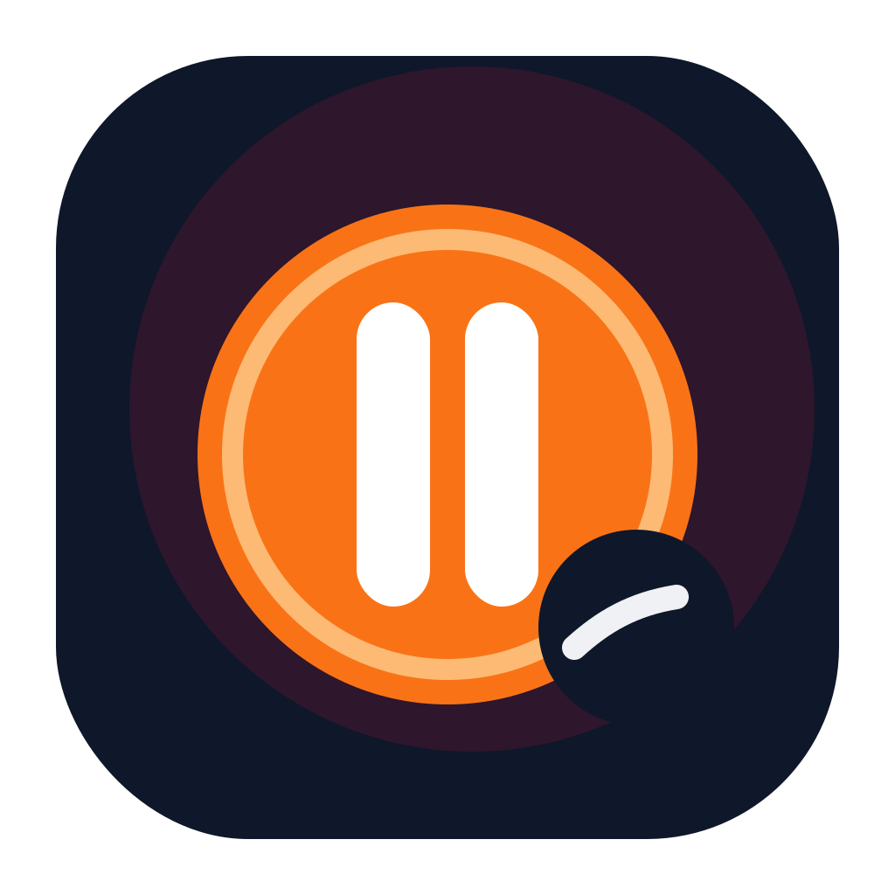

# TokenBreak

**Watch Reels & Shorts while your AI codes. It pauses when it needs you.**

> Your AI is thinking. You should be scrolling.

---

## What is this?

You're using AI coding tools — Claude Code, Codex, Antigravity — and most of the time, you're just... waiting. Watching a cursor blink. Staring at a terminal.

**TokenBreak** fills that dead time. It plays Instagram Reels, YouTube Shorts, or TikTok while your AI works. The moment your AI needs your input — a confirmation, a decision, a review — the video **pauses** and tells you to go check.

When you're done and the AI starts working again? Video **resumes**. Simple.

## How it works

```
┌──────────────────────────────────────────┐
│           AI is working...               │
│                                          │
│   ┌──────────────────────────────────┐   │
│   │                                  │   │
│   │     ▶ Playing Reels / Shorts     │   │
│   │                                  │   │
│   └──────────────────────────────────┘   │
│                                          │
│   🟢 AI working — enjoy your video!      │
└──────────────────────────────────────────┘

          AI asks a question...

┌──────────────────────────────────────────┐
│                                          │
│   ┌──────────────────────────────────┐   │
│   │                                  │   │
│   │     ⏸ Your AI needs you!         │   │
│   │     Check your terminal.         │   │
│   │                                  │   │
│   └──────────────────────────────────┘   │
│                                          │
│   🟡 AI needs your attention!            │
└──────────────────────────────────────────┘
```

## Features

- **Auto play/pause** — Videos play while AI works, pause when it needs you
- **Multi-tool support** — Claude Code, Claude Team, Codex, Antigravity
- **Multi-platform** — YouTube Shorts, Instagram Reels, TikTok
- **Cross-platform** — macOS, Windows, Linux
- **10 languages** — EN, KO, JA, ZH, ES, FR, DE, PT, AR, HI
- **System tray** — Runs quietly, flashes when AI needs attention
- **Dark mode** — Because obviously

## Download Binaries

Prebuilt binaries should be downloaded from the GitHub Releases page, not from the Git history:

- **Latest release downloads**: [github.com/shoutme1991/TokenBreak/releases/latest](https://github.com/shoutme1991/TokenBreak/releases/latest)
- **All releases**: [github.com/shoutme1991/TokenBreak/releases](https://github.com/shoutme1991/TokenBreak/releases)

Release assets to upload:

- **macOS (Apple Silicon / arm64)**: `TokenBreak-1.0.0-arm64.dmg`, `TokenBreak-1.0.0-arm64-mac.zip`
- **Windows (x64)**: `TokenBreak Setup 1.0.0.exe`, `TokenBreak 1.0.0.exe`
- **Linux (x64)**: `TokenBreak-1.0.0.AppImage`

## Support TokenBreak

If TokenBreak saves you from staring at a blinking cursor, consider supporting the project.
Donations help keep development, testing, maintenance, and new features moving.

- **Ethereum**: `0x4F696fD890f9cb1aC368f997c9D312D9906FcB15`
- **Bitcoin**: `bc1qts0cdkfpe7u7kvxz38sl3p6hagxpt0k63qxt77`
- **Solana**: `8pBV8PSJ8feg542rhLF55d8b7TekmVmhXWnr1dWzoFs6`
- **Linea**: `0x4F696fD890f9cb1aC368f997c9D312D9906FcB15`
- **Base**: `0x4F696fD890f9cb1aC368f997c9D312D9906FcB15`
- **BNB Chain**: `0x4F696fD890f9cb1aC368f997c9D312D9906FcB15`
- **Polygon**: `0x4F696fD890f9cb1aC368f997c9D312D9906FcB15`
- **Optimism**: `0x4F696fD890f9cb1aC368f997c9D312D9906FcB15`
- **Arbitrum**: `0x4F696fD890f9cb1aC368f997c9D312D9906FcB15`
- **Tron**: `TRdLucn7Mhn3Z4ZCy1PdyKrbiaU67oMoAb`

## Quick Start

```bash
# Clone
git clone https://github.com/YOUR_USERNAME/TokenBreak.git
cd TokenBreak

# Install
npm install

# Run
npm start
```

## Setup

1. **Launch TokenBreak**
2. **Select your AI tools** — Pick which tools you use (auto-detects installed ones)
3. **Pick your content** — YouTube Shorts, Instagram Reels, or TikTok
4. **Hit Start** — That's it. Go back to your AI tool and work.

TokenBreak monitors your AI tools in the background. When your tool asks for input, the video pauses and an overlay tells you to check your terminal.

## Supported AI Tools

| Tool | Status |
|------|--------|
| Claude Code | ✅ Supported |
| Claude Team | ✅ Supported |
| OpenAI Codex | ✅ Supported |
| Antigravity | ✅ Supported |

## Build

```bash
# macOS (current machine architecture)
npm run dist:mac

# Windows x64
npx electron-builder --win --x64

# Linux x64
npx electron-builder --linux --x64
```

Build outputs are written to `dist/`.
Upload the generated binaries to GitHub Releases instead of committing them into the repository.

## Project Structure

```
TokenBreak/
├── main.js              # Electron main process
├── preload.js           # Context bridge (main ↔ renderer)
├── renderer/
│   ├── index.html       # App UI
│   ├── styles.css       # Dark theme styles
│   └── app.js           # UI logic & video control
├── mcp/
│   ├── monitor.js       # AI tool state monitor
│   ├── tools.js         # Tool-specific adapters
│   └── config.js        # Monitor configuration
├── i18n/
│   ├── en.json          # English
│   ├── ko.json          # 한국어
│   ├── ja.json          # 日本語
│   ├── zh.json          # 中文
│   ├── es.json          # Español
│   ├── fr.json          # Français
│   ├── de.json          # Deutsch
│   ├── pt.json          # Português
│   ├── ar.json          # العربية
│   └── hi.json          # हिन्दी
└── assets/              # Icons & tray images
```

## How AI monitoring works

TokenBreak watches your AI tools' activity by monitoring their local state files and logs:

1. **File watching** — Detects file changes in tool directories (e.g., `~/.claude/`)
2. **Pattern matching** — Identifies "waiting for input" vs "working" states
3. **Debounced transitions** — Prevents flickering between states
4. **Instant pause** — Waiting-for-input triggers immediately (no debounce delay)

No network traffic is intercepted. No data is sent anywhere. Everything is local.

## Adding a new AI tool

Create an adapter in `mcp/tools.js`:

```js
class MyToolAdapter extends BaseAdapter {
  getState() {
    if (!this.detect()) return 'idle';
    if (this.matchPatterns(this.config.waitingPatterns)) return 'waiting_for_input';
    if (this.hasRecentActivity(3000)) return 'working';
    return 'idle';
  }
}
```

Then add its config to `mcp/config.js` and register it in the `ADAPTER_MAP`.

## Adding a new language

1. Copy `i18n/en.json` to `i18n/xx.json`
2. Translate all values
3. The app picks it up automatically

## Security & Privacy

TokenBreak is designed to be safe and transparent:

- **100% local** — All AI tool monitoring is done by reading local files. No network interception.
- **No data collection** — Zero telemetry, zero analytics, zero tracking.
- **Sandboxed** — Electron sandbox enabled, strict CSP, context isolation.
- **Webview isolation** — Social media sites run in isolated processes with restricted permissions.
- **Input validation** — All IPC channels validate inputs against whitelists.

See [SECURITY.md](SECURITY.md) for full details and vulnerability reporting.

## Contributing

PRs welcome. Keep it simple, keep it fun.

## License

MIT

---

*Built for developers who refuse to stare at a blinking cursor.*
